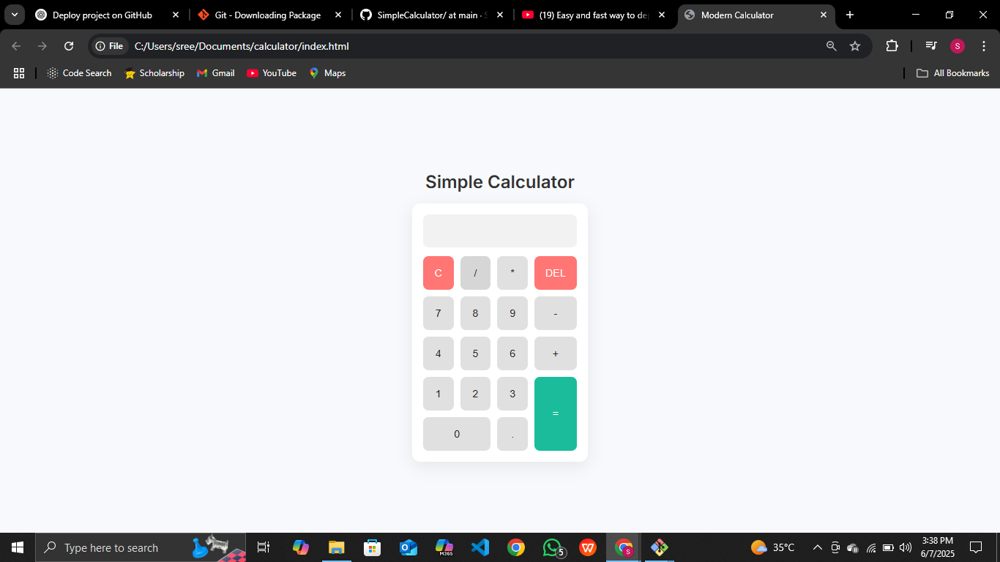

# Simple Calculator

A modern, responsive calculator built with HTML, CSS, and JavaScript. This calculator performs basic arithmetic operations with a clean, user-friendly interface.

## Features

- Basic operations: addition, subtraction, multiplication, division
- Clear (C) and delete (DEL) functionality
- Error handling for invalid expressions
- Responsive design that works on all devices
- Clean, modern UI with intuitive button layout
- Keyboard support (coming soon)

## Technologies Used

- HTML5
- CSS3 (Grid layout, custom properties)
- JavaScript (ES6)

## Installation

No installation required! Simply:

1. Download or clone this repository
2. Open `index.html` in your web browser

## Usage

1. Click the number buttons to input values
2. Use the operation buttons (+, -, *, /) for calculations
3. Press "=" to see the result
4. Use "C" to clear or "DEL" to delete the last character

## Future Improvements

- Add keyboard support for inputs
- Implement scientific calculator functions
- Add history feature for previous calculations
- Support for dark/light mode toggle

## Contributing

Contributions are welcome! Please open an issue or submit a pull request for any improvements.

## License

This project is open source and available under the [MIT License](LICENSE).
